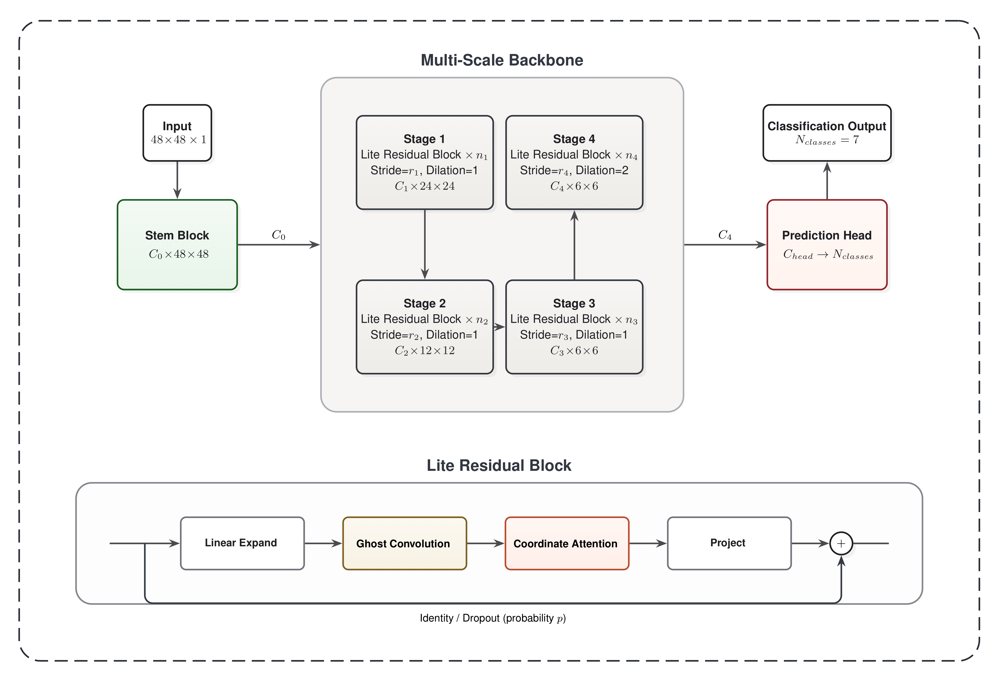

# SwiftResNet: Lightweight Facial Expression Recognition with Coordinate Attention and Ghost Convolutions

## Overview

SwiftResNet is a lightweight deep convolutional network for facial expression recognition (FER) on FER2013 and FER+ datasets. The architecture integrates **Coordinate Attention** and **Ghost Convolutions** into a MobileNet-style inverted residual framework, achieving competitive accuracy with substantially fewer parameters than conventional ResNet backbones.



## Architecture

The core building block, `LiteResidualBlock`, combines three components:

- **Ghost Convolution** — Splits standard convolution into a primary path and a cheap linear transformation path, reducing FLOPs while preserving representational capacity.
- **Coordinate Attention** — Encodes spatial dependencies along both horizontal and vertical directions via adaptive pooling, producing direction-aware attention maps without the computational cost of full self-attention.
- **DropPath** — Stochastic depth regularization with linearly increasing drop probability across blocks.

The model is offered in four scales: **Micro**, **Nano**, **Tiny**, and **Small**, configurable via `get_extractnet_config()`.

## Training Recipe

Recommended configuration (SwiftResNet-Small):

| Component | Setting |
|---|---|
| Loss | Symmetric Cross Entropy (SCE) with label smoothing ($\alpha=1.0$, $\beta=0.3$) |
| Augmentation | MixUp ($\alpha=0.1$) + CutMix ($\alpha=0.45$), random erase, affine transforms |
| Optimizer | SGD with Nesterov momentum ($\mu=0.9$), weight decay $9\times10^{-5}$ |
| Schedule | Warm-up Plateau Cosine Decay (WPCD): 10-epoch linear warmup → plateau → cosine annealing to $\eta_{\min}=3\times10^{-6}$ |
| Regularization | Gradient clipping (1.0), label smoothing (0.1) |
| Reproducibility | Deterministic cuDNN, fixed seed across all random sources |


### WPCD Ablation Study (Micro, 0.87M)

| Group | Schedule | $T_{\mathrm{plat}}$ | $T_{\mathrm{decay}}$ | Acc (%) |
|---|---:|---:|---:|---:|
| A | Cosine (baseline) | 0 | 288 | 68.82 |
| C | Cosine (extended) | 0 | 300 | 69.38 |
| B | WPCD (short plateau) | 1 | 300 | 69.02 |
| D | **WPCD (long plateau)** | 10 | 300 | **69.82** |

*All variants use the same base training configuration; only plateau length and cosine $T_{\mathrm{decay}}$ differ.*

## Baselines

The following architectures were reimplemented and adapted for the FER domain (grayscale 48×48 input, 7-class output) for fair comparison:

- ResNet-18 / ResNet-50
- AlexNet
- ShuffleNetV2
- MobileNetV2

## Results

### Model Comparison on FER2013

| Method | Params (M) | Protocol | Acc (%) | F1 (%) | DI | Year |
|---|---|---|---|---|---|---|
| **Reference CNN Architectures** | | | | | | |
| AlexNet | 57.00 | Re-implemented | 71.30 | 70.30 | 0.502 | 2026 |
| VGG-based | 138.0 | Reported | 73.28 | — | 1.000 | 2021 |
| ResNet18 | 11.17 | Re-implemented | 73.42 | 71.50 | 0.081 | 2026 |
| ResNet50 | 23.51 | Re-implemented | 72.44 | — | 0.215 | 2026 |
| **Lightweight FER Models** | | | | | | |
| MobileNetV2 | 2.70 | Re-implemented | 69.21 | 67.10 | 0.568 | 2026 |
| ShuffleNetV2 | 1.30 | Re-implemented | 70.88 | 69.40 | 0.342 | 2026 |
| Mini-Xception | 0.06 | Reported | 66.00 | — | 1.000 | 2017 |
| LightExNet | 3.27 | Reported | 69.17 | — | 0.573 | 2025 |
| RS-Xception | 3.40 | Reported | 69.02 | 67.50 | 0.594 | 2024 |
| FGENet | 2.10 | Reported | 70.49 | — | 0.395 | 2024 |
| **Modified Training Protocol** | | | | | | |
| RLR-CNet$^\dagger$ | 1.02 | Custom | 71.14 | — | 0.307 | 2023 |
| **Proposed (PrivateTest)** | | | | | | |
| Ours-Micro | 0.87 | PrivateTest | 69.82 | 69.80 | 0.485 | 2026 |
| Ours-Nano | 2.94 | PrivateTest | 70.88 | 70.00 | 0.343 | 2026 |
| Ours-Tiny | 8.17 | PrivateTest | 72.33 | 72.20 | 0.158 | 2026 |
| **Ours-Small** | **17.35** | **PrivateTest** | **72.42** | **71.90** | **0.184** | 2026 |

$\text{DI}_i = \sqrt{(1-\bar{A}_i)^2 + \bar{P}_i^2}$, where $\bar{A}_i,\bar{P}_i$ are min–max normalised accuracy and parameter count. DI measures Euclidean distance to the ideal point $(1,0)$ in normalised Acc–Params space; lower is better.

"Re-implemented" models share training hyperparameters with the closest SwiftResNet scale: ShuffleNetV2 → micro, MobileNetV2 → nano, ResNet18 → tiny, AlexNet/ResNet50 → small. $^\dagger$RLR-CNet uses a custom train/test split with data expansion; all other models train on standard FER2013 splits without external data or pretrained weights.

### Zero-Shot Cross-Dataset Evaluation

Models trained on FER2013 were directly evaluated on FER+ and RAF-DB without fine-tuning.

| Model | Params (M) | FER2013 | FER+ | RAF-DB Acc (%) | RAF-DB F1 |
|---|---|---|---|---|---|
| *SwiftResNet-Micro* | 0.87 | 69.82 | 82.35 | 61.76 | 33.45 |
| *SwiftResNet-Nano* | 2.94 | 70.88 | 83.97 | 55.88 | 34.39 |
| *SwiftResNet-Tiny* | 8.17 | 72.33 | 84.93 | 61.76 | 36.64 |
| *SwiftResNet-Small* | 17.35 | 72.42 | 84.37 | 61.76 | 42.09 |
| AlexNet | 57.00 | 71.30 | — | 55.88 | 26.76 |
| ResNet18 | 11.17 | 73.42 | — | 67.65 | 39.00 |
| ResNet50 | 23.51 | 72.44 | — | 58.82 | 35.51 |
| MobileNetV2 | 2.70 | 69.21 | — | 64.71 | 52.56 |
| ShuffleNetV2 | 1.30 | 70.88 | — | 67.65 | 42.38 |

*Note: When trained on FER+ instead of FER2013, SwiftResNet variants achieve improved zero-shot transfer to RAF-DB: 64.71% / 70.59% / 67.65% / 73.53% accuracy and 31.15 / 34.47 / 31.97 / 35.68 F1 (Micro to Small).*

## Quick Start

```bash
# Install dependencies
pip install torch torchvision numpy matplotlib seaborn scikit-learn tqdm

# Train SwiftResNet (small)
python train.py --seed 67

# Modify model/scale in config.py or via config overrides
```

## Project Structure

```
├── model/
│   ├── SwiftResNet.py      # Core model: CoordAttention, GhostConv, SwiftResNet
│   ├── ResNet18.py         # ResNet-18 adapted for FER
│   ├── ResNet50.py         # ResNet-50 adapted for FER
│   ├── AlexNet.py          # AlexNet adapted for FER
│   ├── ShuffleNetv2.py     # ShuffleNetV2 adapted for FER
│   └── MobileNetv2.py      # MobileNetV2 adapted for FER
├── train.py                # Training loop with WPCD, SCE, MixUp/CutMix, AMP
├── config.py               # Hyperparameter defaults
├── dataset.py              # Data loading with augmentation pipeline
├── utils.py                # SCELoss, mixup/cutmix utilities, seed setting
├── figs/                   # Figures and visualizations
├── FERPLUS/                # FER+ dataset
└── RAF-DB/                 # RAF-DB dataset
```

## License

This project is licensed under the Apache License 2.0. See [LICENSE](LICENSE) for details.
